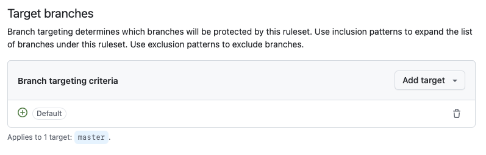
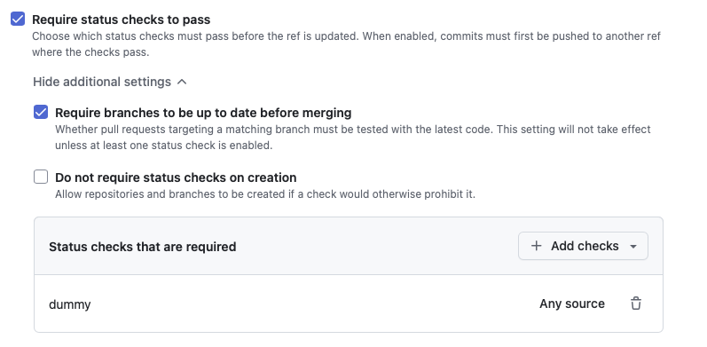
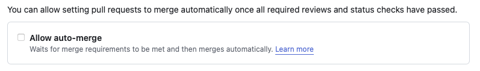
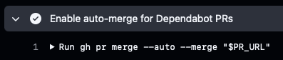
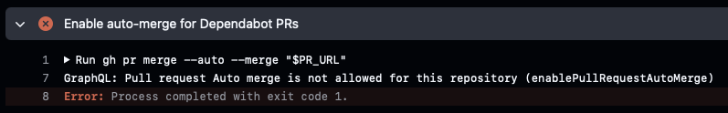
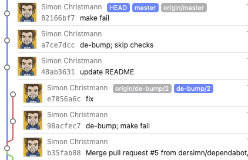
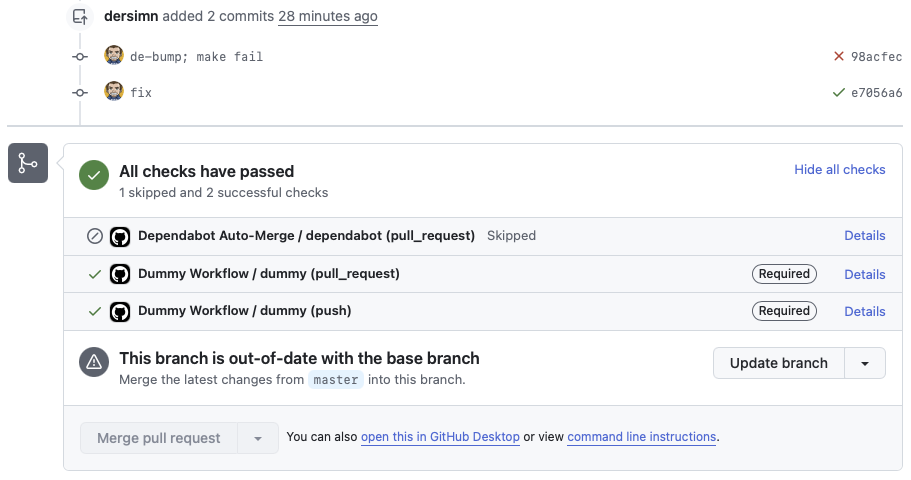

## Findings

- Using the `GITHUB_TOKEN` works, __but__ it won't trigger any following Workflows. You can still use this if you don't build any code on GitHub anyways.

- When using a Personal Access Token you need the permissions:
    - Fine-grained personal access token:
        - Contents read/write
        - Pull-requests: read/write
        - (basically that's the same that you specify in YAML for `GITHUB_TOKEN`)
    - Classic Token needs only scope `repo`

- Secret must be set under `Secrets and Variables > Dependabot`:

    

    It won't be accessible by the Pull Request when saving under `Secrets and Variables > Actions`. Typical error message is:

    ```
    github-token is not set! Please add 'github-token: "${{ secrets.GITHUB_TOKEN }}"' to your workflow file.
    ```

- Using Event `pull_request_target` instead gives access to `Secrets and Variables > Actions` variables, **but** read this first:

    - [Keeping your GitHub Actions and workflows secure Part 1: Preventing pwn requests](https://securitylab.github.com/resources/github-actions-preventing-pwn-requests/)

- Using "Ruleset" with these settings:

    
    

  Ensures that `dummy.yml` Workflow must be successful in order to merge PR.

    - Side Effect: You can't push directly to `master` anymore.
    - Leaving _Status checks that are required_ empty is like disabling the rule (there seems to be no way of saying _all_ checks must pass).
    - It is possible to circumvent the checks by hacking `dummy.yml` in the Pull Request (because the YAML within the PR is used to for status check and _not_ the YAML in the current `master` branch).

- When Auto-Merge is enabled:

    

  Even a failing PR (because the required Status Checks are failing) will result in a successful Job, even if the PR is not merged into master yet:

    

  You then have to check-out the branch and fix the failing Workflows (pushing to the branch is allowed `dependabot/something`). If you push this back and the Workflows are succeeding, the PR is immediately merged.

- With Auto-Merge disabled the job fails

    

  and fixing it offline and pushing back will not auto-merge, you still habe to click in GitHub PR to merge.

- When having _Require branches to be up to date before merging_ enabled, it is not possible to merge `de-bump/2` here, even if all required steps are succeeding:

    
    

  Clicking the _Update branch_ button causes a merge `master` into `de-bump/2`.


## Clean Testing

For clean testing, re-create the Repository on GitHub when it gets to polluted with Tags and Releases:

    gh repo delete --yes
    gh repo create --public ${${$(git remote get-url origin)##*/}%.git}
    gh secret set PERSONAL_ACCESS_TOKEN --body '<TOKEN>' --app dependabot

    git tag | xargs git tag -d
    git push -u origin master
