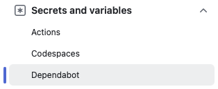

Findings:

- Using the `GITHUB_TOKEN` works, __but__ it won't trigger any following Workflows. You can still use this if you don't build any code on GitHub anyways.

- When using a Personal Access Token you need the permissions:
    - Fine-grained personal access token:
        - Contents read/write
        - Pull-requests: read/write
        - (basically that's the same that you specify in YAML for `GITHUB_TOKEN`)
    - Classic Token needs only scope `repo`

- Secret must be set under `Secrets and Variables > Dependabot`:

    

    It won't be accessible by the Pull Request when saving under `Secrets and Variables > Actions`. Typical error message is:

    ```
    github-token is not set! Please add 'github-token: "${{ secrets.GITHUB_TOKEN }}"' to your workflow file.
    ```

- Using Event `pull_request_target` instead gives access to `Secrets and Variables > Actions` variables, **but** read this first:

    - [Keeping your GitHub Actions and workflows secure Part 1: Preventing pwn requests](https://securitylab.github.com/resources/github-actions-preventing-pwn-requests/)